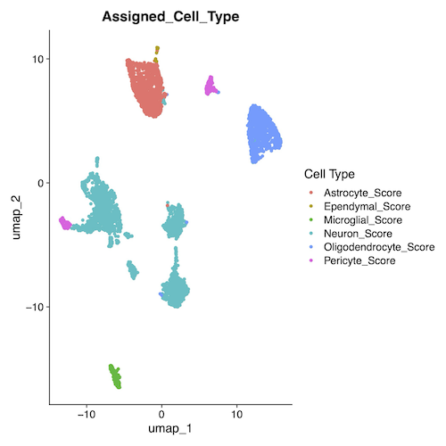
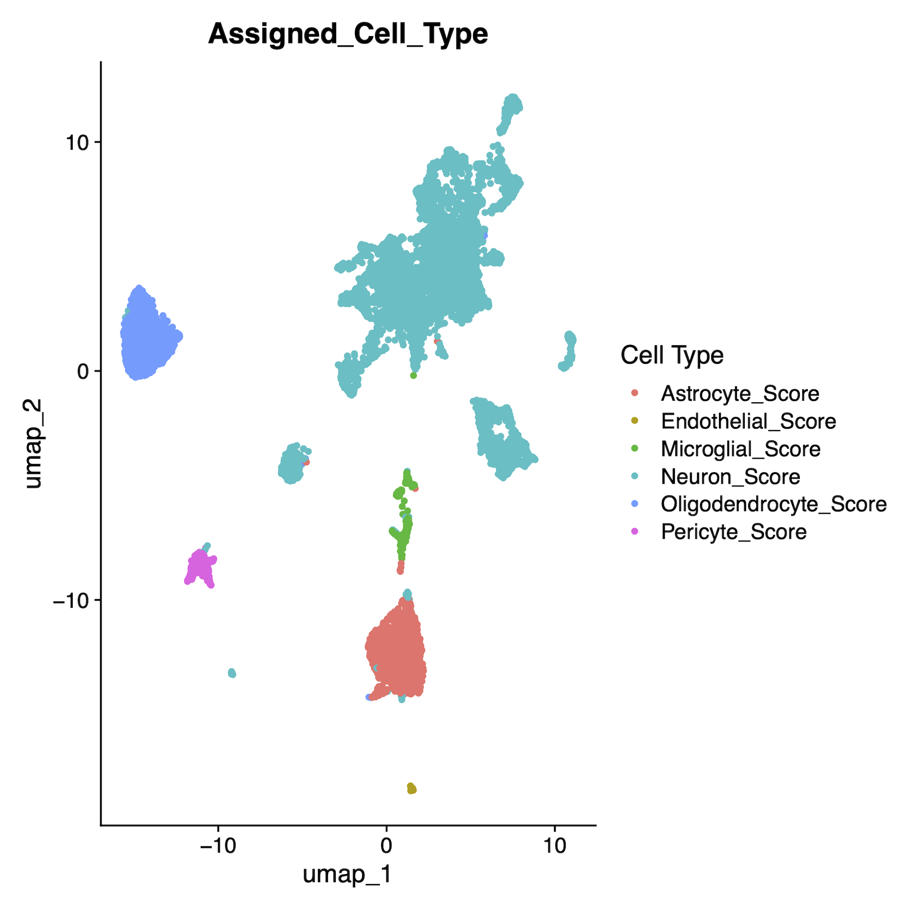

## Description
This analysis was completed from August 2024-April 2025 using single nucleus RNA-seq data collected in 2023 and 2024 by the Trainor lab in the UC Davis Department of Psychology. Analysis guidance was provided by the Nord lab at the UC Davis Center for Neuroscience. 
PVN samples were collected from 24 California mice (Peromyscus californicus) (N = 8 males, 16 females). Sequencing was performed by the UC Davis Bioinformatics Core using the 10x Genomics Chromium Nuclei Isolation kit, yielding ~87,000 sequenced nuclei. Raw data was processed with the 10X Genomics CellRanger pipeline before analysis in RStudio using Seurat v5.

## Summary of coding steps
**1. Preprocessing** \
Seurat object creation 
\
Quality control/filtering 
\
Normalization (SCTransform) \
Integration \
PCA and clustering

Subset vasopressin cells \
Subset oxytocin cells

**2. Cell type assignment** \
Module-based scoring (Cell type 0) \
By-cluster annotation (Cell type 1) \
Visualization

*Vasopressin cells by assigned cell type* \
 \
[Download high-resolution PDF](2-PVN_cell_type_assignment/umap_avpcells_assignedcelltype.pdf) 

*Oxytocin cells by assigned cell type* \
 \
[Download high-resolution PDF](2-PVN_cell_type_assignment/umap_oxtcells_assignedcelltype.pdf) 

**3. Analysis of female vasopressin neurons** \
Subset vasopressin cells for neurons \
Subset female vasopressin neurons \
Create counts matrix with Pseudobulk \
Create metadata object (coldata) \
Create DESeq2 dataset \
Run DESeq2

**4. Analysis of male vasopressin neurons** \
Subset male vasopressin neurons \
Create counts matrix with Pseudobulk \
Create metadata object (coldata) \
Create DESeq2 dataset \
Run DESeq2

**5. Analysis of female oxytocin neurons** \
Subset oxytocin cells for neurons \
Subset female oxytocin neurons \
Create counts matrix with Pseudobulk \
Create metadata object (coldata) \
Create DESeq2 dataset \
Run DESeq2

**6. Analysis of male oxytocin neurons** \
Subset male oxytocin neurons \
Create counts matrix with Pseudobulk \
Create metadata object (coldata) \
Create DESeq2 dataset \
Run DESeq2 

**7. DE results visualization** \
Standardize volcano plot axes \
Generate volcano plots

## Limitations
This analysis was exploratory and had limited sample sizes. Full reproducibility has not been verified in the current R environment, and results should be interpreted with caution. This workflow should serve as a reference for analytical approaches rather than definitive conclusions. \
—There were twice as many female as male samples, so male analyses may be relatively underpowered.

## Future directions / Things to change
—Using FindVariableFeatures and ScaleData before SCTransform is unnecessary. \
—SCTransform should be run on individual samples rather than merged objects. \
—Use either the full Seurat SCT integration workflow or Harmony, not both. \
—Annotate all cell types and identify neurons before subsetting by Avp and Oxt expression. This allows for more robust annotation (since more data is included) and more accurate Avp and Oxt expression thresholds (since only neuronal Avp and Oxt expression is considered). \
—Use the counts layer of the RNA assay instead of the SCT assay to determine Avp and Oxt expression thresholds.

